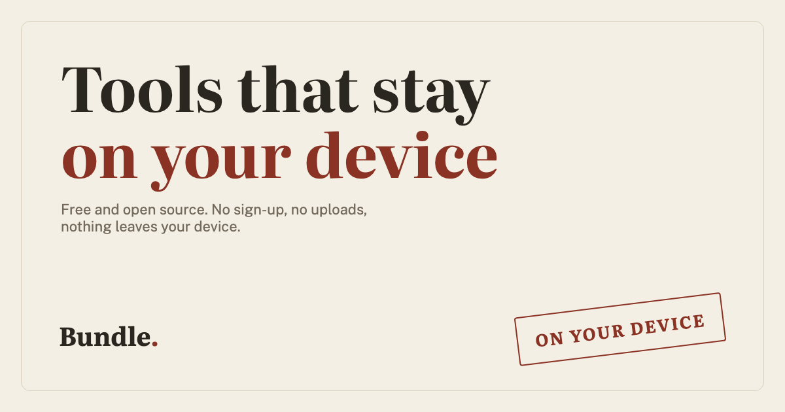

<p align="center">
  
</p>

<h1 align="center">Bundle</h1>
<p align="center"><strong><a href="https://bundle.tools">bundle.tools</a></strong></p>

<p align="center">
  <a href="https://github.com/3141roy/personal-toolkit/actions/workflows/ci.yml"></a>
  <a href="LICENSE"></a>
  
</p>

A privacy-first web toolkit - PDF, image, and dev tools that run entirely in the browser.

- **Nothing leaves your device.** No uploads, no server, no accounts, no analytics.
- **Enforced, not just promised.** A strict Content-Security-Policy with `connect-src 'self'`
  means the site is physically unable to phone home, checkable in your network tab.
- **Free and open source**, MIT licensed, no ads, no paid tier - ever.

## Tools

### PDF

- [Merge](https://bundle.tools/pdf/merge/) - combine PDFs into one file, in the order you pick
- [Split](https://bundle.tools/pdf/split/) - pull pages out of a PDF, by range or one file per page
- [Organize](https://bundle.tools/pdf/organize/) - reorder, delete, or pull in pages from other PDFs
- [Compress](https://bundle.tools/pdf/pdf-compress/) - shrink a PDF's file size
- [Images to PDF](https://bundle.tools/pdf/images-to-pdf/) - turn photos or scans into one PDF
- [Markdown to PDF](https://bundle.tools/pdf/md-to-pdf/) - turn a markdown file into a PDF

### Image

- [PDF to Images](https://bundle.tools/image/pdf-to-images/) - export every page of a PDF as JPG or PNG
- [Resize](https://bundle.tools/image/resize/) - shrink or enlarge, in px or %
- [Compress](https://bundle.tools/image/compress/) - shrink file size
- [Convert](https://bundle.tools/image/convert/) - between PNG, JPEG, and WebP
- [Crop](https://bundle.tools/image/crop/) - trim down to a region
- [Rounded crop](https://bundle.tools/image/round-crop/) - circle/square crop for profile pictures
- [Rotate & flip](https://bundle.tools/image/rotate/) - turn or mirror an image
- [Metadata](https://bundle.tools/image/metadata/) - see and clear what's hiding in a photo's EXIF data
- [HEIC to JPG](https://bundle.tools/image/heic-to-jpg/) - turn an iPhone photo into a regular JPG
- [Bulk](https://bundle.tools/image/bulk/) - resize, compress, or convert many images at once

### Dev

- [JSON format](https://bundle.tools/dev/json-format/) - format, minify, or validate, with a tree view
- [JSON to CSV](https://bundle.tools/dev/json-csv/) - convert between JSON and CSV, either direction
- [JSON to YAML](https://bundle.tools/dev/json-yaml/) - convert between JSON and YAML, either direction

### Text

- [Text diff](https://bundle.tools/text/text-diff/) - compare two blocks of text, line by line and word by word
- [Word counter](https://bundle.tools/text/text-count/) - words, characters, and lines, live as you type

More on the way - see [CONTRIBUTING.md](CONTRIBUTING.md) if you want to add one.

## Stack

Astro (static shell) · Svelte islands (interactive tools) · plain CSS tokens · TypeScript ·
Web Workers + WebAssembly for heavy work (image codecs, PDF compression) · self-hosted
fonts. Deployed on Cloudflare Workers (static assets).

## Running locally

```
git clone https://github.com/3141roy/personal-toolkit.git
cd personal-toolkit
npm install
npm run dev
```

Requires Node `>=22.12.0`.

```
npm run build      # production build
npm test             # unit + real-browser tests
npm run typecheck     # astro check
npm run lint            # prettier --check .
```

## Contributing

See [CONTRIBUTING.md](CONTRIBUTING.md) - project layout, how to add a tool, commit and PR
conventions, and how preview deploys work.

## License

[MIT](LICENSE) © 3141Roy
